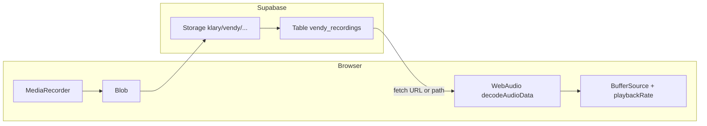

# Vendy: Record, store in Supabase, list, delete, pitch-shift

## Is it possible?

Yes. The stack lines up with what you already have in `[src/App.jsx](c:\Users\user name\Documents\shadow\voodoo\src\App.jsx)`:

- **Recording**: `MediaRecorder` on a `getUserMedia({ audio: true })` stream (or a loopback if you ever mix desk audio) produces a `Blob` (typically `audio/webm`).
- **Pitch shift**: Your engine already uses `AudioBufferSourceNode` + `playbackRate` for file mode; any recording becomes the same after `audioCtx.decodeAudioData(arrayBuffer)`.
- **Supabase**: `@supabase/supabase-js` for Storage upload + Postgres CRUD; optional signed URLs if the bucket is private.

## Dependencies

- Add `**@supabase/supabase-js**` to `[package.json](c:\Users\user name\Documents\shadow\voodoo\package.json)` (not present today).
- Create a small module e.g. `[src/lib/supabaseClient.js](c:\Users\user name\Documents\shadow\voodoo\src\lib\supabaseClient.js)` using `import.meta.env.VITE_SUPABASE_URL` and `import.meta.env.VITE_SUPABASE_PUBLISHABLE_DEFAULT_KEY` (your `.env` keys are already named correctly for Vite).

**Security note:** Anything prefixed with `VITE_` is bundled into the client. The **anon** key is designed to be public; protection comes from **RLS** and **Storage policies**, not from hiding the key.

## Database: table + RLS (SQL you run in Supabase SQL editor)

Suggested table name: `**vendy_recordings`** (or `vendy_audio`).

Columns (minimal + useful):

| Column         | Type                                   | Purpose                                                                                   |
| -------------- | -------------------------------------- | ----------------------------------------------------------------------------------------- |
| `id`           | `uuid` PK, `default gen_random_uuid()` | Row id                                                                                    |
| `storage_path` | `text` UNIQUE NOT NULL                 | Object key inside bucket, e.g. `vendy/{id}.webm`                                          |
| `public_url`   | `text` NULLABLE                        | Cached `getPublicUrl` result if bucket is public; else NULL and use signed URL at runtime |
| `title`        | `text`                                 | User-facing label (default e.g. timestamp)                                                |
| `duration_sec` | `real` NULLABLE                        | From recording stop event when available                                                  |
| `mime_type`    | `text`                                 | e.g. `audio/webm`                                                                         |
| `created_at`   | `timestamptz` default `now()`          | Sorting                                                                                   |

**Single-user / demo RLS (you chose this):** enable RLS and add policies that allow the `**anon`** role to `SELECT`, `INSERT`, `UPDATE`, `DELETE` on `vendy_recordings`. This makes the app work with only the publishable key from the client, but **anyone who has your project URL + anon key can modify data**—acceptable only for a private prototype. Tighten later with Supabase Auth or Edge Functions + `service_role` kept server-side.

Example policy pattern (one statement per operation, or use `FOR ALL`):

- `CREATE POLICY "anon_all_vendy_recordings" ON public.vendy_recordings FOR ALL TO anon USING (true) WITH CHECK (true);`

(Adjust role name if you use `authenticated` only later.)

## Storage bucket policies

- Bucket name: `**klary`**. Object prefix: `**vendy/`** (matches your folder).
- In Supabase Dashboard → Storage → `klary` → Policies: allow `anon` (or `authenticated`) to **insert**, **select**, **update**, **delete** objects whose name starts with `vendy/` (policy expressions on `storage.objects` using `(storage.foldername(name))[1] = 'vendy'` or `name like 'vendy/%'` depending on Supabase version/UI).

If the bucket is **private**, playback should use `**createSignedUrl(storage_path, expiresIn)`** in the client when building the source for `fetch`; if **public**, store or compute `getPublicUrl` and save in `public_url`.

## App behavior (implementation outline)

1. **New input mode** (e.g. `record` + `**library`** or extend tabs): **Record** → stop → upload; **Library** lists rows from `vendy_recordings` ordered by `created_at desc`.
2. **Record flow**: `MediaRecorder` → on `stop`, `blob` → `supabase.storage.from('klary').upload('vendy/'+fileName, blob, { contentType, upsert: false })` → `insert` into `vendy_recordings` with `storage_path`, `mime_type`, `title`.
3. **List**: `supabase.from('vendy_recordings').select('*').order('created_at', { ascending: false })` — optionally add pagination (`range`).
4. **Play + pitch shift**: On row select, `fetch(url)` → `arrayBuffer()` → `decodeAudioData` → assign to existing `state.audioBuffer` and reuse `startFile` / `togglePlay` / gesture loop (same as file mode). You may add `engine.setRecordingBuffer(buffer)` to swap without reloading `audio.mp3`.
5. **Delete**: `window.confirm(...)` → `storage.from('klary').remove([storage_path])` then `from('vendy_recordings').delete().eq('id', id)` (order: storage first or DB first; handle partial failure in UI).

## Optional hardening (later)

- **Supabase Edge Functions** + **service role** secret (never in Vite) for upload/delete if you outgrow open anon policies.
- **Auth** so RLS uses `auth.uid()` and each user only sees their rows.

## Files to touch (when implementing)

- `[package.json](c:\Users\user name\Documents\shadow\voodoo\package.json)` — add `@supabase/supabase-js`
- New: `src/lib/supabaseClient.js`
- `[src/App.jsx](c:\Users\user name\Documents\shadow\voodoo\src\App.jsx)` (or split UI): recording controls, library list, delete confirm, wire `audioBuffer` from fetched recording
- `[src/App.css](c:\Users\user name\Documents\shadow\voodoo\src\App.css)` — list / record button layout

## Deliverable SQL (condensed)

You will run in Supabase SQL editor:

1. `create table public.vendy_recordings (...);`
2. `alter table public.vendy_recordings enable row level security;`
3. Policies for `anon` (or your chosen role) as above.
4. Storage policies on bucket `klary` for path prefix `vendy/`.

I will provide the **full exact SQL** in the implementation PR/commit (including `storage` policies compatible with your project’s Postgres version).